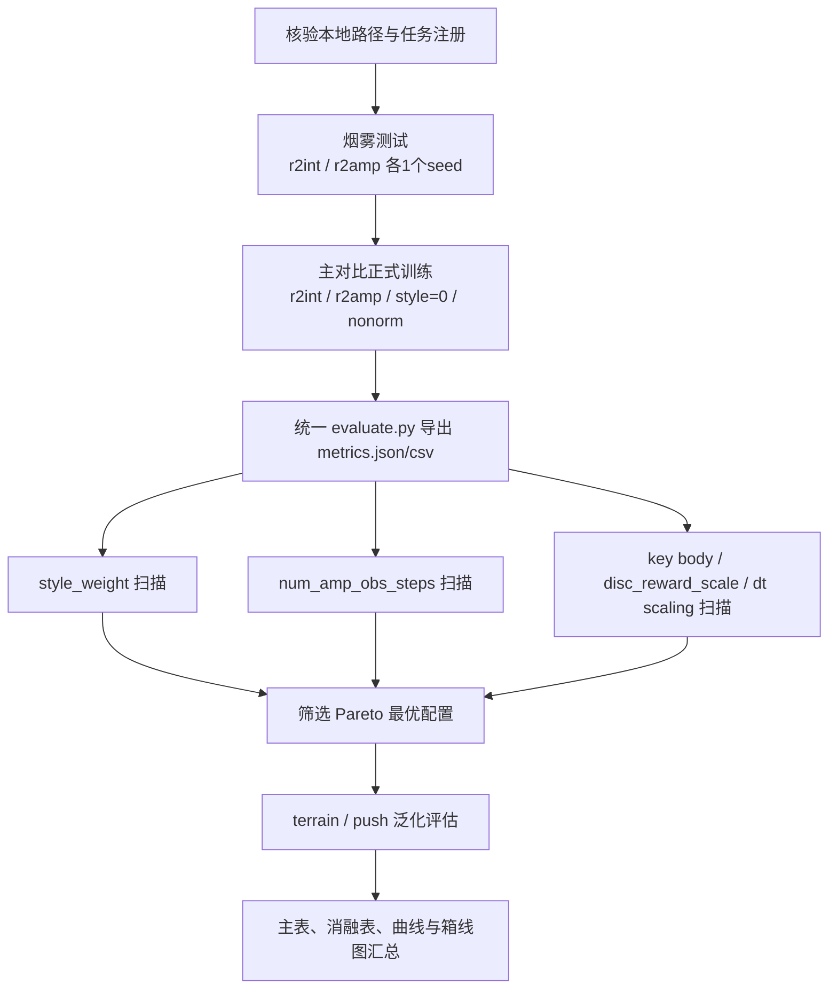
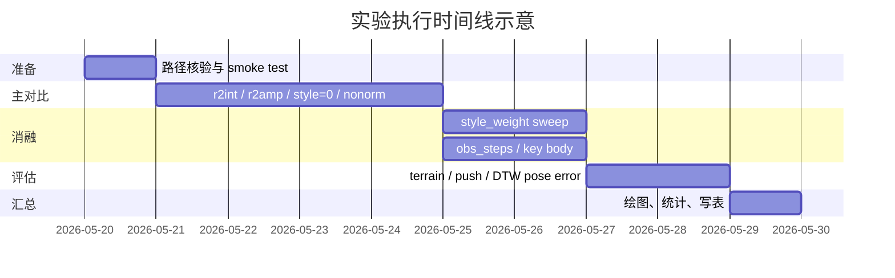

# 基于 VR_Teleoperation 的 AMP 对比与消融实验设计报告

## 执行摘要

本报告给出一份面向正式论文/技术报告的实验设计方案，目标是在你当前仓库的既有代码框架上，对 **Task-only PPO (`r2int`)** 与 **AMP-PPO (`r2amp`)** 做可复现实验对比，并系统考察 **去掉 style reward、关闭 style reward 归一化、改变 `style_reward_weight`、改变 `num_amp_obs_steps`、改变 key body 选择、改变 `disc_reward_scale`、关闭 `scale_style_reward_by_dt`** 等实现细节所带来的影响。设计原则有两条：一是尽量贴合你当前项目所依赖的上游结构，即 `legged_gym` 的训练/播放脚本、配置继承、任务注册与“非零 reward scale 自动映射到 reward 函数”的组织方式；二是尽量贴合 AMP 原论文的评价思想，即把“任务目标”和“动作风格”分开，采用 **任务奖励 + 风格奖励线性组合** 的范式来分析收益与代价。citeturn36view0turn29view0turn29view1turn30view2

需要说明的是：本次检索中，用户给出的 `VR_Teleoperation` GitHub URL 没有被网页索引直接抓取到，因此本报告对 `r2int`、`r2amp`、`r2_amp_config.py`、`AMPPPO`、`compute_amp_obs` 等命名，采用“**以你当前仓库命名为准**”的保守策略；凡是无法从公开网页直接核验的路径，均明确标注为“**待本地 `grep/find` 确认**”。与之相对，训练脚本形态、CLI 参数、配置结构、任务注册方式，则以 `legged_gym` 官方 README 为上游结构依据；训练后端与 PPO 组织方式，则参考 `RSL-RL` 官方仓库与论文；AMP 的奖励分解、判别器观测和评价思想，则以 AMP 原论文为一手依据。citeturn36view0turn20view0turn21view0turn18view0turn29view1turn30view1turn31view0

从实验策略上，建议把研究分成两层。第一层是**主对比**：`r2int`、`r2amp`、`r2amp` 去掉 style reward、`r2amp` 不归一化。第二层是**机制消融**：重点扫 `style_reward_weight`、`normalize_style_reward`、`num_amp_obs_steps`、key body 子集、`disc_reward_scale`、`scale_style_reward_by_dt`。统一协议建议至少使用 **3 个随机种子** 做全量重复，主结果表最好使用 **5 个随机种子**；每个种子固定 **32 个评估 episode**，这与 AMP 论文在 task return 与 pose error 统计上的报告习惯一致。若训练预算允许，主比较应覆盖 **100M–300M samples** 的训练区间，因为 AMP 原论文的任务实验也大体位于这一量级。citeturn38view0turn31view0

最终交付上，建议新增一个**尽量小而不侵入的** `legged_gym/scripts/evaluate.py`：复用现有加载逻辑，统一读取 checkpoint，执行固定 command presets，输出 `metrics.json` 与 `metrics.csv`；同时可选接入 motion loader，按 AMP 论文的方式对参考 motion 与策略轨迹做 DTW 对齐，再计算 `joint_pose_error_dtw_m`。这样可以在几乎不改训练主干的前提下，把实验从“看视频”升级为“可统计、可画图、可复现实验表”的标准研究流程。AMP 原论文明确指出：AMP 的价值不在于逐帧同步模仿，而在于通过判别器引入风格先验，因此在报告中必须把**任务完成能力**与**风格自然性**分开汇报。citeturn29view1turn30view2turn31view0

## 代码基线与证据边界

你的项目从命名上看，属于典型的 `legged_gym` + `rsl_rl` 体系：`legged_gym` 官方 README 公开说明了训练入口 `legged_gym/scripts/train.py`、测试入口 `legged_gym/scripts/play.py`、`--task/--seed/--max_iterations/--checkpoint/--headless` 等 CLI 参数，以及“每个环境由 env 文件和 config 文件组成，非零 reward scale 会自动映射到同名 reward 函数，任务通过 `task_registry.register` 注册”的组织方式。`RSL-RL` 官方 README 与论文则说明，这一后端本身就是面向机器人研究的轻量、高吞吐、GPU 优先训练库，包含 PPO，并被 `legged_gym` 直接使用。citeturn36view0turn21view0turn20view0

因此，本报告对你仓库的**可验证部分**与**待本地确认部分**做如下分层：

| 层级 | 内容 | 状态 | 依据 |
|---|---|---:|---|
| 会话已知 | 任务名 `r2int`、`r2amp` | 已知 | 由你在当前会话中给出 |
| 会话已知 | 需优先围绕 `r2_amp_config.py`、`AMPPPO`、`compute_amp_obs`、reward 项目展开 | 已知 | 由你在当前会话中给出 |
| 上游可核验 | `train.py` / `play.py`、`--task` / `--seed` / `--max_iterations` / `--checkpoint` / `--headless` | 已核验 | `legged_gym` 官方 README |
| 上游可核验 | config 继承、reward scale 自动映射到 reward 函数、`task_registry.register` | 已核验 | `legged_gym` 官方 README |
| 上游可核验 | PPO 后端、GPU 优先训练、`legged_gym` 使用 `rsl_rl` | 已核验 | `RSL-RL` 官方 README / 论文 |
| 需本地确认 | `r2_amp_config.py` 的准确子目录、`AMPPPO` 的准确模块路径、`compute_amp_obs` 的函数签名、`style_reward_weight` 等实际默认值 | 待确认 | 建议本地 `find/grep` |

建议先在本地仓库执行一组**只读确认命令**，把所有路径锚定下来，再批量跑实验。下列命令是为你当前需求设计的最小核验集：

```bash
find legged_gym -type f \( -name '*r2*config*.py' -o -name '*amp*config*.py' \)

grep -R "task_registry.register" -n legged_gym

grep -R "AMPPPO\|compute_amp_obs\|style_reward_weight\|normalize_style_reward\|num_amp_obs_steps\|disc_reward_scale\|scale_style_reward_by_dt" -n .
```

如果你想把实验做成“零歧义复现”，建议把核验结果补到一个简短的 `EXPERIMENT_INDEX.md`，把以下五个项逐一写清楚：**任务名**、**配置文件路径**、**训练类路径**、**判别器观测生成函数路径**、**reward 混合的配置字段名**。这一步本身不改变任何训练逻辑，但会显著降低实验后期整理结果时的出错概率。`legged_gym` 的配置-任务注册机制本来就鼓励这种“显式列清楚 config 与 task name”的工作方式。citeturn36view0

从算法层面，AMP 原论文为本设计提供了几条特别关键的理论抓手。第一，AMP 将奖励显式拆为“**任务奖励**”和“**风格奖励**”，并线性组合。第二，风格奖励来自判别器，而不是手工逐帧 tracking reward。第三，判别器输入重点关注 root 速度、关节局部旋转/速度和末端执行器位置，而不是任务特定特征。第四，AMP 在训练中使用 replay buffer、reference state initialization 和 early termination 以增强稳定性。正因为如此，本报告的所有消融都围绕“风格项强度”“风格项尺度处理”“判别器时间上下文”“判别器观测子集”来设计。citeturn29view1turn30view1turn30view2turn31view3

## 对比方法与消融矩阵

### 主对比方法

主表建议至少包含下列五个方法。它们都可以沿用 `legged_gym/scripts/train.py` 的 CLI 形式；其中 `--task=r2int` 和 `--task=r2amp` 是本会话中已经确定的任务名，而 `--seed`、`--max_iterations`、`--headless`、`--checkpoint` 等参数形式，则与 `legged_gym` 官方 README 一致。citeturn36view0

| 方法名 | 训练命令模板 | 主要配置路径 | 关键超参 | 设计目的 |
|---|---|---|---|---|
| Task-only PPO | `python legged_gym/scripts/train.py --task=r2int --headless --seed=${SEED} --max_iterations=${ITERS}` | `legged_gym/envs/<R2子目录>/..._config.py`，子目录未指定 | `seed`、`max_iterations`、PPO 默认超参 | 纯任务奖励基线，回答“没有 motion prior 时，任务能做到什么程度” |
| AMP-PPO | `python legged_gym/scripts/train.py --task=r2amp --headless --seed=${SEED} --max_iterations=${ITERS}` | `.../r2_amp_config.py`，准确路径待本地确认 | `style_reward_weight`、`normalize_style_reward`、`disc_reward_scale`、`num_amp_obs_steps` | 主方法 |
| AMP-PPO w/o style reward | 同 `r2amp`，但将 `style_reward_weight=0` | 同上 | `style_reward_weight=0` | 消除风格项，检验收益是否真正来自 AMP style term |
| AMP-PPO 不归一化 | 同 `r2amp`，但 `normalize_style_reward=False` | 同上 | `normalize_style_reward=False` | 检验 reward 尺度整形是否决定训练稳定性 |
| AMP-PPO style weight sweep | 同 `r2amp`，跑多组权重 | 同上 | `style_reward_weight∈{0.005,0.01,0.02,0.05}` | 找到任务收益与风格收益的 Pareto 点 |

这里的逻辑非常直接：**Task-only PPO** 对应 AMP 论文图表里的 “No Data / from scratch” 思路，是应该保留的强基线；而 **AMP-PPO w/o style reward** 则是最关键的“伪 AMP”控制组，它保留 AMP 代码路径与训练骨架，但切断 style term，从而能把“判别器框架本身”的影响和“style reward 真正生效”的影响分开。AMP 论文也强调了其核心并不是另一个更强的 PPO，而是“用 motion prior 提供 style reward，再与 task reward 组合”的学习范式。citeturn29view1turn30view2turn38view0

### 消融实验清单

下表是建议的**完整消融矩阵**。为了保证报告有分析张力，建议不要一次性全部与主实验同等预算跑满；更合理的方式是：先完成主对比，再围绕最敏感的三个因素做全预算消融，其余因素做半预算扫描。

| 消融项 | 具体配置 | 目的 | 预期结果 | 风险提示 |
|---|---|---|---|---|
| `style_reward_weight` | `0, 0.005, 0.01, 0.02, 0.05` | 研究 task/style 权衡曲线 | 随权重增大，style 指标先升后饱和，任务 tracking 可能出现 U 形退化 | 过大时策略追 style 而不追 task |
| `normalize_style_reward` | `True / False` | 研究风格奖励尺度整形是否必要 | 关闭后方差更大，种子间差异更明显 | 可能导致早期不稳定或 disc 主导 |
| `num_amp_obs_steps` | `1 / 2 / 4` | 研究判别器时间上下文是否足够 | `1` 往往更像“姿态分类器”，`2` 或 `4` 对动态风格更敏感 | 上下文过长可能增大判别器学习难度 |
| key body 选择 | `feet-only / hands-only / hands+feet / hands+feet+pelvis` | 研究判别器应关注哪些身体部位 | `feet-only` 易偏 locomotion，`hands+feet` 更适合 whole-body | key body 太多会引入噪声，太少会丢失风格信息 |
| `disc_reward_scale` | `5 / 10 / 20` | 研究风格 reward 的绝对量级 | 中等值通常最稳；过低信号弱，过高会破坏 task 平衡 | 与 `style_reward_weight` 共线，需分层分析 |
| `scale_style_reward_by_dt` | `True / False` | 检查 reward 是否按时间步长归一 | 打开后在不同 control dt 下更可比 | 关闭时比较结果容易被 control frequency 混淆 |
| 参考 motion 数据子集 | `walk-only / run-only / mixed locomotion` | 验证 gait 多样性来源于 motion prior 还是 task 本身 | mixed 数据应在较大速度范围内更优 | 若 mixed 无收益，可能说明判别器没学到风格切换 |

以上每一项都有明确的理论指向。AMP 论文明确说明：任务奖励与风格奖励是线性组合的，因此 `style_reward_weight` 必然直接决定优化方向的平衡；同时论文强调，判别器观测需要覆盖 root 速度、关节旋转/速度与末端执行器位置，这正是 `num_amp_obs_steps` 与 key body 选择值得系统消融的原因。论文还指出 least-squares discriminator 的 reward 会经历 offset、scaling 与 clipping，这就为 `disc_reward_scale` 与 reward normalization 的敏感性实验提供了理论基础。citeturn29view1turn30view1turn31view3

### 建议的配置落地方式

这里有一个很实际的工程问题：`legged_gym` 官方 README 公开说明，CLI 默认覆盖的是 `--task`、`--seed`、`--max_iterations`、`--checkpoint`、`--experiment_name`、`--run_name` 等少量字段，并没有承诺支持任意嵌套 config 的命令行覆盖。也就是说，像 `style_reward_weight`、`normalize_style_reward`、`num_amp_obs_steps` 这类字段，很可能不能直接靠 CLI 改。citeturn36view0

因此，本报告建议你在“尽量不动训练主干”的前提下，二选一落地：

| 方案 | 改动规模 | 复现性 | 适用场景 |
|---|---:|---:|---|
| 派生 config + 注册新 task | 小 | 很高 | 适合正式论文与长期维护 |
| 增加一个 `--cfg_override_json` 小补丁 | 小 | 高 | 适合一次性大量扫参数 |

如果你更重视**审稿友好性**，推荐第一种：例如在 `r2_amp_config.py` 附近新增若干派生配置类，并注册成 `r2amp_sw000`、`r2amp_nonorm`、`r2amp_obs4`、`r2amp_feetonly` 等任务名。这样所有命令都保持标准 `--task=` 形式，最利于实验追踪。如果你更重视**扫参效率**，则推荐第二种：只给 `train.py` 增加一个 JSON patch 入口，把小范围 override 在运行时 merge 到 config 中。前者更“论文”，后者更“工程”。结合你的偏好，我更建议**主方法与主消融用派生 config，探索性 sweep 用 JSON patch**。

## 统一训练与评估协议

### 训练协议

AMP 原论文的任务实验采用了大致 **100–300 million samples** 的训练预算，并且在 task return 与 imitation 评价上都使用了 **3 个随机种子**、**每个模型 32 个评估 episode** 的统计范式。对你当前项目，一个兼顾严谨与预算的协议是：**主比较跑到 150M samples 作为第一轮固定预算；最优两组再延长到 300M samples 作为最终表格结果**。这样既能保证“同预算公平比较”，又能避免把所有 ablation 都拖到 full budget 才发现方向不对。citeturn38view0turn31view0

推荐协议如下：

| 项目 | 建议值 | 备注 |
|---|---|---|
| 主比较训练预算 | `150M samples` 起步，最好补足到 `300M samples` | 与 AMP 论文量级对齐 |
| 机制消融预算 | `75M–150M samples` | 半预算足以判断趋势 |
| 随机种子 | 主表 `5` 个，最少 `3` 个 | 建议固定 `0, 1, 2, 3, 4` |
| 评估 episode 数 | 每 seed / preset 至少 `32` 个 | 与 AMP 论文统计习惯一致 |
| checkpoint 保存频率 | 每 `100` 迭代一次，外加 best checkpoint | 建议同时保存 `last` / `best_task` / `best_style` |
| 训练曲线评估频率 | 每 `50` 迭代 | 便于观察收敛与崩溃 |
| 硬件假设 | **无特定约束** | 若可选，优先单机单 GPU，一致用同档 GPU |
| 运行模式 | `--headless` | 减少渲染干扰 |

之所以推荐单独保留 `best_task` 和 `best_style` 两类 checkpoint，是因为 AMP 的优势本来就可能不在纯 task return 上，而在“几乎不损失任务性能的前提下，显著增加 motion fidelity”。如果只保留单一 `best_reward`，很容易把实验结论压扁到一个总分上。AMP 原论文多次强调，task objective 与 style objective 是分离的，风格质量不能完全被 task return 替代。citeturn29view1turn30view2turn31view0

### 评估协议

推荐把评估分成三个层面：**固定命令 preset 评估**、**泛化评估**、**轨迹级 imitation 评估**。这样可以避免只看训练日志而忽略 deployment 风格与稳定性。

| 评估层面 | 预设 | 评价重点 |
|---|---|---|
| 固定命令 presets | `stand`、`walk_slow`、`walk_fast`、`turn`、`strafe` | tracking、稳定性、style、能耗 |
| 泛化评估 | rough terrain、随机推力 push、摩擦/质量轻扰动 | robustness / degradation |
| imitation 评估 | 参考 motion 对齐后的 joint pose error / key-body error | whole-body fidelity |

建议的 command presets 可以固定为：

| preset | `v_x` | `v_y` | `yaw_rate` | 时长 |
|---|---:|---:|---:|---:|
| `stand` | 0.0 | 0.0 | 0.0 | 未指定则用环境默认 episode |
| `walk_slow` | 0.5 | 0.0 | 0.0 | 同上 |
| `walk_fast` | 1.2 | 0.0 | 0.0 | 同上 |
| `turn_left` | 0.4 | 0.0 | 0.6 | 同上 |
| `strafe_right` | 0.0 | 0.3 | 0.0 | 同上 |
| `push_recovery` | 0.8 | 0.0 | 0.0 | 期间注入外扰 |

如果你的环境支持 terrain curriculum，则应额外固定一组“terrain level sweep”。`legged_gym` 的项目页面明确说明，其 game-inspired curriculum 会依据机器人在不同 terrain 上的通过情况动态提升/降低 level，这为“按地形等级统计成功率/退化量”提供了很自然的评估入口。citeturn34view0turn33view0

### 统计方法

统计层面，不建议只报单个 best seed。正式主表建议报告 **mean ± std**，同时给出 **95% bootstrap confidence interval**。若主表只有 3 个 seed，则不要过度渲染显著性检验；更稳妥的做法是：把“seed 作为独立重复”，给出方法间的 **均值差 + bootstrap CI + 相对改变量**。若能跑到 5 个 seed，则可再补充 **Welch t-test** 或 **paired permutation test** 作为附录。这个处理比单纯写 “ours better” 更符合严谨报告体裁。

## 评价指标与输出规范

AMP 原论文对“为什么不能只看 task return”讲得很清楚：AMP 的本质是用判别器定义 style reward，因而报告必须把**任务性能**和**动作自然性**分开；同时，由于 AMP 不使用 phase 同步，若要对齐参考 motion，应该像论文那样先做 **DTW**，再算 pose error。`legged_gym` 上游则提供了 reward scale 与 reward 函数同名映射的结构，非常适合把 tracking、smoothness、torque、contact 等项统一导出。citeturn29view1turn30view2turn31view0turn36view0

### 指标定义

下表给出建议的**统一指标清单**。凡是可以直接从现有张量读出的，优先不改环境；凡是与参考 motion 对齐有关的，放在 `evaluate.py` 中离线计算。

| 类别 | 指标名 | 定义 |
|---|---|---|
| 任务性能 | `lin_vel_rmse` | \(\sqrt{\frac{1}{T}\sum_t \|v_{xy,t}-v^{cmd}_{xy,t}\|_2^2}\) |
| 任务性能 | `yaw_vel_rmse` | \(\sqrt{\frac{1}{T}\sum_t (\omega_{z,t}-\omega^{cmd}_{z,t})^2}\) |
| 任务性能 | `task_return_mean` | 每 episode 任务回报均值 |
| 任务性能 | `normalized_task_return_mean` | 若环境已定义归一化 task return，则直接输出；未定义则标“未指定” |
| 稳定性 | `fall_rate` | `non_timeout_resets / total_episodes` |
| 稳定性 | `episode_length_mean_steps` | 平均 episode 步数 |
| 稳定性 | `base_height_violation_rate` | `1/T * Σ 1[h_base < h_min]` |
| 稳定性 | `roll_pitch_violation_rate` | `1/T * Σ 1[|roll|>r_max or |pitch|>p_max]` |
| 动作自然性 / AMP | `amp_style_reward_mean` | `1/T * Σ r_style,t` |
| 动作自然性 / AMP | `amp_style_reward_raw_mean` | 归一化前/clip 前 style reward 均值，若仓库暴露该值 |
| 动作自然性 / AMP | `disc_loss_mean` | 判别器 loss 均值 |
| 动作自然性 / AMP | `disc_ref_logit_mean` | 参考 motion logits 均值 |
| 动作自然性 / AMP | `disc_policy_logit_mean` | 策略样本 logits 均值 |
| 动作自然性 / AMP | `disc_gap_mean` | `disc_ref_logit_mean - disc_policy_logit_mean` |
| 动作自然性 / AMP | `joint_pose_error_dtw_m` | DTW 对齐后，根坐标系下所有关节相对位置的平均误差 |
| 动作自然性 / AMP | `key_body_error_dtw_m` | DTW 对齐后，key body 相对位置误差 |
| 上肢质量 | `hand_rel_pos_error_m` | 双手相对 pelvis / root 位置误差均值 |
| 上肢质量 | `arm_joint_limit_violation_rate` | 手臂关节触碰上下限的时间比例 |
| 上肢质量 | `arm_action_l2_mean` | 手臂动作幅值均值 |
| 效率与平滑性 | `torque_l2_mean` | `1/T * Σ ||τ_t||_2^2` |
| 效率与平滑性 | `mech_power_mean` | `1/T * Σ |τ_t · qdot_t|`，若可得 |
| 效率与平滑性 | `action_rate_l2_mean` | `1/(T-1) * Σ ||a_t-a_{t-1}||_2^2` |
| 效率与平滑性 | `dof_acc_l2_mean` | `1/(T-1) * Σ ||(qdot_t-qdot_{t-1})/dt||_2^2` |
| 泛化 | `terrain_success_rate` | 固定 terrain set 上无跌倒通过比例 |
| 泛化 | `terrain_level_max` | curriculum 或固定测试集上的最高可通过等级 |
| 泛化 | `push_recovery_rate` | push 后未跌倒且 2s 内 tracking 恢复的比例 |
| 泛化 | `tracking_degradation_under_push_pct` | `100*(rmse_push-rmse_clean)/(rmse_clean+eps)` |

其中 `joint_pose_error_dtw_m` 强烈建议做。AMP 论文在单 clip imitation 中采用的正是“**先 DTW，再在根坐标系下比较所有关节相对位置**”的评估方式，因为 AMP 不使用 phase 同步，直接逐帧比较会夸大误差。论文还明确指出，判别器观测强调 root 速度、关节局部旋转/速度与末端执行器位置，因此 `key_body_error_dtw_m`、`hand_rel_pos_error_m` 与 `disc_gap_mean` 这三类指标组合起来，能比单独的 task return 更真实地反映 AMP 是否真的“学到了风格”。citeturn31view0turn31view3turn30view2

### `metrics.json` / `metrics.csv` 字段名

建议把所有指标落到统一 schema，方便后续画图与出表。推荐字段如下：

```text
run_id
task_name
method_name
ablation_name
seed
checkpoint
preset_name
num_episodes
episode_seconds
lin_vel_rmse
yaw_vel_rmse
task_return_mean
normalized_task_return_mean
fall_rate
episode_length_mean_steps
base_height_violation_rate
roll_pitch_violation_rate
amp_style_reward_mean
amp_style_reward_raw_mean
disc_loss_mean
disc_ref_logit_mean
disc_policy_logit_mean
disc_gap_mean
joint_pose_error_dtw_m
key_body_error_dtw_m
hand_rel_pos_error_m
arm_joint_limit_violation_rate
arm_action_l2_mean
torque_l2_mean
mech_power_mean
action_rate_l2_mean
dof_acc_l2_mean
terrain_success_rate
terrain_level_max
push_recovery_rate
tracking_degradation_under_push_pct
wall_clock_seconds
notes
```

建议 JSON 采用“每个 run 一个对象、包含所有 preset 的子对象”的结构，CSV 则采用“**一行一个 seed × checkpoint × preset**”的扁平结构。JSON 适合存层次信息，CSV 适合 pandas / Excel / matplotlib 直接消费。

## 运行脚本与最小代码改动

### 最小代码改动建议

最优先、也最小的改动，是新增一个 `legged_gym/scripts/evaluate.py`，而不是去大改 `train.py` 或环境主逻辑。`legged_gym` 官方 README 已经说明了 `train.py` / `play.py` 是标准入口，因此 `evaluate.py` 最好只是一个**评估封装层**：复用已有的环境构建、任务注册和 checkpoint 加载逻辑，不引入新的训练分支。citeturn36view0

建议新增/可选新增的文件如下：

| 文件 | 是否必须 | 作用 |
|---|---:|---|
| `legged_gym/scripts/evaluate.py` | 必须 | 统一加载 checkpoint、跑 fixed presets、输出 `metrics.json/csv` |
| `legged_gym/utils/metrics.py` | 可选 | 放指标计算函数，避免 `evaluate.py` 过长 |
| `configs/ablation/*.json` | 可选 | 若采用 JSON patch 覆盖 config，用于记录 sweep |

如果你希望完全不碰训练逻辑，那么只新增 `evaluate.py` 就足够。若你还希望让 `style_reward_weight`、`normalize_style_reward` 之类参数能用命令行覆盖，则再加一个很小的 `--cfg_override_json` 入口即可。因为 `legged_gym` README 公开列出的 CLI 覆盖字段本来就偏少，加入一个 JSON patch 是最自然、也最容易 code review 的做法。citeturn36view0

### `evaluate.py` 伪代码

```python
# legged_gym/scripts/evaluate.py
import json
import csv
from pathlib import Path

def main(args):
    # 1) build env and load policy
    env, train_cfg = make_env_from_task(args.task)   # 复用现有 task_registry
    policy, runner = load_checkpoint(args.task, args.checkpoint)

    # 2) optional motion loader / discriminator hooks
    motion_loader = getattr(env, "motion_loader", None)
    has_amp_obs = hasattr(env, "compute_amp_obs") or hasattr(env, "amp_obs_buf")
    discr = find_discriminator_from_runner(runner)  # 若存在 AMPPPO / discriminator

    presets = [
        {"preset_name": "stand", "vx": 0.0, "vy": 0.0, "yaw": 0.0},
        {"preset_name": "walk_slow", "vx": 0.5, "vy": 0.0, "yaw": 0.0},
        {"preset_name": "walk_fast", "vx": 1.2, "vy": 0.0, "yaw": 0.0},
        {"preset_name": "turn_left", "vx": 0.4, "vy": 0.0, "yaw": 0.6},
        {"preset_name": "strafe_right", "vx": 0.0, "vy": 0.3, "yaw": 0.0},
    ]

    rows = []
    for preset in presets:
        stats = init_stats()
        for ep in range(args.num_episodes):
            obs = env.reset()
            set_command_preset(env, preset)

            traj = []
            done = False
            while not done:
                act = policy(obs)
                obs, rew, done, info = env.step(act)

                frame = collect_frame(env, act, info)
                if has_amp_obs:
                    frame["amp_obs"] = env.compute_amp_obs() if hasattr(env, "compute_amp_obs") else env.amp_obs_buf
                traj.append(frame)

            # 3) episode metrics
            ep_metrics = compute_episode_metrics(traj)

            # 4) optional AMP metrics
            if discr is not None and has_amp_obs:
                ep_metrics.update(compute_disc_metrics(discr, traj))

            # 5) optional imitation metrics
            if motion_loader is not None:
                ref = sample_reference_motion(motion_loader, preset, len(traj))
                ep_metrics.update(compute_dtw_pose_metrics(traj, ref))

            stats = update_stats(stats, ep_metrics)

        rows.append(finalize_stats(args, preset, stats))

    out_dir = Path(args.output_dir)
    out_dir.mkdir(parents=True, exist_ok=True)
    save_json(out_dir / "metrics.json", rows)
    save_csv(out_dir / "metrics.csv", rows)

if __name__ == "__main__":
    main(parse_args())
```

这段伪代码的关键点有三处。第一，**不要复制已有 loader 逻辑**，直接复用你当前 `play.py` 或 runner 中的模型加载路径。第二，**如果仓库里已经有 `compute_amp_obs` 或 `amp_obs_buf`，就直接用已有 AMP 观测**，不要在评估脚本里重新拼一份，以免训练/评估观测口径不一致。第三，**参考 motion 的 joint pose error 放在离线评估侧**，而不是混进训练 reward，这样既符合 AMP 论文“训练时不依赖同步 tracking reward”的思想，又能在报表中给出更直接的 imitation 证据。citeturn29view1turn30view2turn31view0

### 命令行模板

主实验可以先按以下模板组织。`EXTRA_CFG` 部分取决于你最终采用“派生 task”还是“JSON patch”策略：

```bash
# Task-only PPO
python legged_gym/scripts/train.py \
  --task=r2int \
  --headless \
  --seed=0 \
  --max_iterations=3000

# AMP-PPO
python legged_gym/scripts/train.py \
  --task=r2amp \
  --headless \
  --seed=0 \
  --max_iterations=3000

# 评估
python legged_gym/scripts/evaluate.py \
  --task=r2amp \
  --checkpoint=path/to/model.pt \
  --num_episodes=32 \
  --output_dir=outputs/r2amp_seed0_eval
```

如果你采用 JSON patch 方案，可把命令扩展成：

```bash
python legged_gym/scripts/train.py \
  --task=r2amp \
  --headless \
  --seed=0 \
  --max_iterations=3000 \
  --cfg_override_json=configs/ablation/r2amp_nonorm.json
```

## 结果呈现、可视化与成功判据

### 主表与消融表模板

主结果表建议采用如下结构。最关键的是，**不要只放“总 reward”一列**；至少要同时放 task、stability、style、energy 四类量。

| Method | lin_vel_rmse ↓ | yaw_vel_rmse ↓ | fall_rate ↓ | normalized_task_return ↑ | amp_style_reward_mean ↑ | joint_pose_error_dtw_m ↓ | torque_l2_mean ↓ |
|---|---:|---:|---:|---:|---:|---:|---:|
| Task-only PPO (`r2int`) |  |  |  |  |  |  |  |
| AMP-PPO (`r2amp`) |  |  |  |  |  |  |  |
| AMP-PPO w/o style reward |  |  |  |  |  |  |  |
| AMP-PPO nonorm |  |  |  |  |  |  |  |

消融结果表则推荐“参数-趋势-最优点”三元结构，而不是把所有值挤成一张超宽表。

| Ablation | Setting | task_return ↑ | style_reward ↑ | pose_error ↓ | fall_rate ↓ | 结论 |
|---|---|---:|---:|---:|---:|---|
| `style_reward_weight` | 0.005 |  |  |  |  |  |
| `style_reward_weight` | 0.01 |  |  |  |  |  |
| `style_reward_weight` | 0.02 |  |  |  |  |  |
| `style_reward_weight` | 0.05 |  |  |  |  |  |
| `num_amp_obs_steps` | 1 |  |  |  |  |  |
| `num_amp_obs_steps` | 2 |  |  |  |  |  |
| `num_amp_obs_steps` | 4 |  |  |  |  |  |

如果某张表超过 8 列，我建议直接拆成两张表。对于一份研究报告而言，**清楚地把“性能是否变好”和“为什么变好”分开**，比把所有字段塞进单表更重要。

### 训练曲线与图形建议

你要求的图形里，最必要的是四张训练曲线和两张比较图：

| 图形 | 建议形式 | 是否必须 |
|---|---|---:|
| `task_return` 随训练迭代变化 | 折线图 | 必须 |
| `lin_vel_rmse` 随训练迭代变化 | 折线图 | 必须 |
| `amp_style_reward_mean` 随训练迭代变化 | 折线图 | 必须 |
| `fall_rate` / `non_timeout_reset_rate` 随训练迭代变化 | 折线图 | 必须 |
| 最终主方法对比 | 柱状图 | 必须 |
| seed 间分布 | 箱线图 + 抖动点 | 必须 |
| 超宽消融网格 | **优先表格替代** | 推荐 |
| 逐 preset 细分结果 | 分面柱状图或附录表 | 推荐 |

若 seed 数只有 3 个，不建议画 violin plot，因为分布信息会被过度视觉化。用 **boxplot + jitter** 更诚实；如果只是演示 3 个点，其实附录表格往往比图更可信。

下面给一个实验顺序的 mermaid 流程图，便于在报告中交代“为什么先跑哪些，后跑哪些”。



如果你更想在方法部分放时间线，也可以用下列 mermaid gantt：



### matplotlib 示例代码

如果你希望在仓库外快速出图，下面的 matplotlib 片段已经足够用来画“训练曲线 + 均值阴影”：

```python
import pandas as pd
import matplotlib.pyplot as plt

df = pd.read_csv("outputs/all_runs_training_log.csv")
metric = "amp_style_reward_mean"

for method_name, g in df.groupby("method_name"):
    agg = g.groupby("iteration")[metric].agg(["mean", "std"]).reset_index()
    plt.plot(agg["iteration"], agg["mean"], label=method_name)
    plt.fill_between(
        agg["iteration"],
        agg["mean"] - agg["std"],
        agg["mean"] + agg["std"],
        alpha=0.2,
    )

plt.xlabel("iteration")
plt.ylabel(metric)
plt.legend()
plt.tight_layout()
plt.show()
```

### 成功判据、失败模式与应对措施

这是报告里最容易被忽略、但最能体现严谨性的部分。建议像下面这样明确写出“成功”的必要条件，而不是只写“更高更好”。

| 实验 | 成功判据 | 典型失败模式 | 应对措施 |
|---|---|---|---|
| `r2amp` vs `r2int` | `task_return` 不显著下降，同时 `style_reward` 上升、`joint_pose_error_dtw_m` 下降 | AMP 提升 style 但 tracking 明显变差 | 下调 `style_reward_weight` 或 `disc_reward_scale` |
| `r2amp` vs `style_weight=0` | `style_reward`、`disc_gap`、`pose_error` 明显改善 | 指标几乎无差异 | 判别器未真正参与优化；检查 reward 混合与反向路径 |
| `nonorm` vs `norm` | `norm` 版本种子间方差更低，收敛更稳 | `nonorm` 出现 seed 漂移或 disc collapse | 开启 normalize，必要时加 clamp / 调低 disc lr |
| `style_weight` 扫描 | 出现清晰 Pareto 前沿 | 全部权重表现相似 | 风格项可能没有进入有效量级；检查 scale/clipping |
| `num_amp_obs_steps` 扫描 | `2` 或 `4` 优于 `1`，尤其在风格指标上 | `4` 明显更差 | 判别器时间上下文过长，训练难度过高 |
| key body 扫描 | `hands+feet` 在 whole-body 指标更优 | `feet-only` 最优但手臂质量差 | 说明策略只学到步态风格，未学到上肢 |
| `scale_style_reward_by_dt` | 开启后不同 control dt 结果更一致 | 关闭后结果对 dt 极敏感 | 固定 dt 或保留 scaling |

对 AMP 来说，最常见的失败模式有四类。第一类是**判别器过强**：任务表面上有 style gain，但跌倒率和 tracking 明显变坏。第二类是**判别器过弱**：`r2amp` 与 `style=0` 几乎不区分。第三类是**reward 尺度不稳**：不同 seed 的曲线形状完全不同。第四类是**观测设计不足**：脚步看起来对了，但手臂、躯干和转弯中的协调性没有提升。这四类问题分别对应 `style_reward_weight / disc_reward_scale`、reward 接线正确性、normalize/clamp 与 `num_amp_obs_steps / key body` 设计。AMP 论文也特别强调了 least-squares discriminator、gradient penalty、replay buffer 等稳定化细节的重要性，这正说明 AMP 的实验不能只报最终分数，必须把训练曲线与失败案例一起解释。citeturn30view1turn29view2turn30view2

## 可复制的最小实验计划

下面给出一个可以直接复制到项目 README 或实验任务单里的**最小实验计划**。它控制在 6 个实验，已经足够产出一版像样的主表和一版核心消融表。由于你的硬件条件未指定，我把资源栏写成“**无特定约束**”，并给出保守耗时区间。需要注意，AMP 原论文虽然在 CPU + Bullet 设置下给出 30–140 小时量级，而 `legged_gym`/`rsl_rl` 的大规模 GPU 训练框架会更快；但你当前 humanoid + AMP + 判别器的实际耗时仍取决于 `num_envs`、仿真频率、地形复杂度和判别器前向开销，因此下表的时间应视为**经验预估**，不是承诺值。citeturn38view0turn33view0turn20view0

| 实验名 | 命令模板 | 目标 | 预估耗时 | 资源 |
|---|---|---|---|---|
| `E1_r2int_base` | `python legged_gym/scripts/train.py --task=r2int --headless --seed=0 --max_iterations=3000` | Task-only PPO 基线 | 烟雾测试 0.5–1h；正式 6–12h/seed | 无特定约束 |
| `E2_r2amp_default` | `python legged_gym/scripts/train.py --task=r2amp --headless --seed=0 --max_iterations=3000` | AMP 默认主方法 | 烟雾测试 0.5–1h；正式 8–16h/seed | 无特定约束 |
| `E3_r2amp_style0` | 同 `r2amp`，但 `style_reward_weight=0` | 伪 AMP 控制组 | 8–16h/seed | 无特定约束 |
| `E4_r2amp_nonorm` | 同 `r2amp`，但 `normalize_style_reward=False` | 检验 reward 尺度整形 | 8–16h/seed | 无特定约束 |
| `E5_r2amp_sw001` | 同 `r2amp`，但 `style_reward_weight=0.01` | style weight 扫描低值点 | 8–16h/seed | 无特定约束 |
| `E6_r2amp_sw005` | 同 `r2amp`，但 `style_reward_weight=0.05` | style weight 扫描高值点 | 8–16h/seed | 无特定约束 |

如果预算还能再多一档，我建议追加两个实验而不是加更多 seed：

| 加做实验 | 命令模板 | 意义 |
|---|---|---|
| `E7_r2amp_obs4` | 同 `r2amp`，但 `num_amp_obs_steps=4` | 检查时间上下文是否改善风格判别 |
| `E8_r2amp_dtfalse` | 同 `r2amp`，但 `scale_style_reward_by_dt=False` | 检查 reward 时间尺度一致性 |

一个可执行的最小批量计划是：先用 `seed=0` 对 `E1–E6` 各跑一次烟雾测试，确保 200–300 iteration 内曲线形状正常；然后对 `E1–E4` 扩到 **3 个 seed** 做正式主表；再对 `E5–E6` 做 **2–3 个 seed** 的半预算对比；最后对最优 `style_reward_weight` 再补 `E7/E8`。这样在不过度消耗算力的前提下，已经足以回答三件最核心的研究问题：**AMP 有没有用、AMP 的收益是不是 style reward 真正带来的、AMP 最敏感的实现超参是哪几个**。

最后给出一段适合直接写进实验章节开头的文字模板：

> 本文在统一的 `legged_gym + rsl_rl` 训练框架下，比较了 Task-only PPO (`r2int`) 与 AMP-PPO (`r2amp`) 的性能差异，并进一步考察了 style reward 移除、style reward 归一化关闭、style reward 权重变化、判别器时间上下文长度变化等实现因素。所有方法均使用相同的环境、相同的训练预算、相同的随机种子集合与相同的固定 command presets 进行评估。评价指标覆盖任务性能、稳定性、动作自然性、上肢质量、效率与泛化能力，并统一导出为 `metrics.json` 与 `metrics.csv`。对于 imitation quality，本文参照 AMP 原论文，采用 DTW 对齐后的 joint pose error 作为主要指标，以缓解非同步策略与参考轨迹之间的时间错位问题。citeturn36view0turn20view0turn29view1turn30view2turn31view0